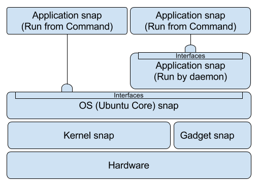

# The kinds of snaps
There are four kinds of snaps used in a snapd system:

 - Kernel
 - Gadget
 - OS
 - Application

These snaps form the architecture of a Snapd System as shown below.

## Kernel snaps

The kernel makes up the core of all Linux systems, and it's the same with a Snapd System.

The kernel snap contains a system’s hardware abstraction layer (HAL). This layer  consists of the kernel, drivers, firmware, and additional libraries such as OpenGL, OpenCL, and alike. In addition the sandboxing and confinement features are provided through the kernel and their effectiveness depend on the security maintenance level of that kernel.

Canonical publishes and maintains kernel snaps, offering reliability, trust, and security. 

You can also create custom kernel snaps for devices. The snap should be based on a Linux kernel with reasonable baseline versioning. However, aligning with the Ubuntu Core LTS default kernel version (currently 3.18) is recommended. This will ensure that devices built using custom kernel snaps benefit from shared information about the kernel, simplifying support and improving development timelines.

## Gadget snaps

Gadget snaps provide a way to define the specific features of a device. They may include definitions of:

- The mechanisms for device initialization, such as key generation and identity certification.
- Processes for the lifecycle of the device, such as factory resets.
- The store the device can access to obtain additional or updated snaps.
- Which channel the device will load snaps from by default. For example, a device may be made available for beta testing, so should pull snaps from the beta channel.
- Details of the device hardware (for example that the device has a camera) and the interfaces (see [Interfaces](/docs/concepts/interfaces.html "Interfaces")) available to access that hardware.

Canonical publishes some gadget snaps for reference platforms, as well as general purpose computing images for popular physical devices, such as 64-bit x86 PCs and Raspberry Pi2.

## OS snaps

The OS snap is a repacked `rootfs` that contains `snapd`; just 'enough' to boot and power the system, and manage snaps. Generally there will also be basic features such as network services, libc, systemd, and others included. OS snaps will be architecture specific, but hardware platform agnostic. As such an OS snap should  run with any kernel that supports the minimum feature set required by the OS.

In every Canonical snappy system the OS snap contains Ubuntu Core (for more details see [Ubuntu Core and Ubuntu Desktop](/docs/concepts/core-classic.html "Ubuntu Core and Ubuntu Desktop")).

Canonical is the publisher of the Ubuntu Core OS snap. It's available for various architectures, such as x86 (32-bit and 64-bit), ARM devices (32-bit and 64-bit), and more. All devices of the same architecture running the same version of the OS use the same snap. The OS is therefore the same for every class of device, whether specialised or general, and developers who target software to a particular snap can be confident it will have access to the same software stack on any snapd system device.

## Application snaps

Application snaps add all the other features and functions to a Snapd System, they are what makes the system useful. They are created by the device developer or third-party developers offering additional features to the device.

An application snap can be run either from a command (that would normally be executed directly or indirectly by the device user) or by a daemon that executes at boot (so effectively offers a service within the device). Generally snaps only need to provide one command, which is run simply by referring to the snap name, for example:

      `$ my_hello_world`

An application snap may also provide multiple commands. To avoid namespace conflicts, commands are prefixed with the snap’s name, for example the following commands run a normal and debug version of a hello world snap:

    `$ my_hello_world.run`
    `$ my_hello_world.debug`

Application snaps can also provide [Interfaces](/docs/concepts/interfaces.html "Interfaces") that expose features to other snaps.

You can create application snaps manually or use the Snapcraft tool. You can find a guide to getting started with Snapcraft in the [Build Apps](/docs/build/ "Build Apps") section.

