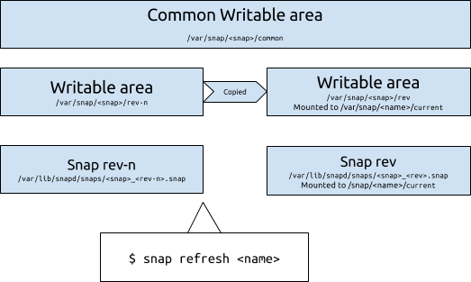

As a snap package is updated, the old version is kept. This enables a snapd system to rollback to an old, known to be good version of a snap if issues are detected in the updated snap. These old copies take up disk space, so garbage collection is performed automatically to ensure they don’t take up too much space, while preserving the ability to rollback snaps.

A snap present in a system can be:

 - `installed` (but not enabled)
 - `enabled`

When a snap is updated, the snap file for the latest version becomes the active snap file. The content from the previous snap version’s writeable areas (`SNAP_USER_DATA` and `SNAP_DATA`) are copied to a new location, for use by the updated snap.

Garbage collection then removes and purges any snap files and their writeable areas for the snap versions prior to the one that has just been updated -- meaning that at most two versions of a snap will be present on the system. This saves disk space without compromising the ability to revert the snap to a previous known-good state.

Explicitly removing a snap from your system will also remove the code and purge the data for all prior versions.

## Example

To illustrate the process take the example of installing and updating `hello-world` through a few versions. If you've version `1.0.1` installed, and do a `snap refresh` it downloads version `1.0.2`:

    $ sudo snap refresh
    64.00 KB / 64.00 KB [======================] 100.00 % 4.62 KB/s    
    Name                 Version               Rev  Developer  Notes
    hello-world          1.0.2                 29   canonical  -

    $ snap list | grep hello
    hello-world          1.0.2                 29   canonical  -
    $ snap list -v | grep hello
    hello-world          1.0.1                 10   canonical  -
    hello-world*         1.0.2                 29   canonical  -

so, `1.0.2`, was downloaded and made active, leaving `1.0.1` installed. Doing the upgrade again:

    $ sudo snap refresh
    64.00 KB / 64.00 KB [======================] 100.00 % 4.62 KB/s
    Name                 Version               Rev  Developer  Notes
    hello-world          1.0.3                 32   canonical  -

    $ snap list -v | grep hello
    hello-world          1.0.2                 29   canonical  -
    hello-world*         1.0.3                 32   canonical  -

and `1.0.1` is gone.
