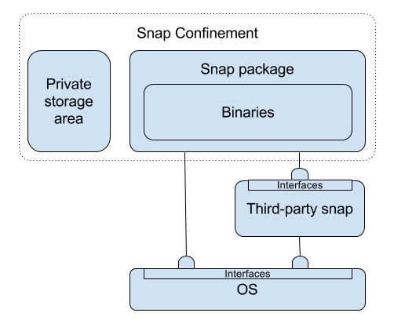

Title: The Snappy System

# The Snappy System

In traditional Linux distributions software is distributed in packages:

- that rely on the availability of services in the OS or other software.
- whose data isn't confined, so can be accessed by other software.
- that can be detrimentally effected by system or software upgrade.
- that are complex to uninstall or downgrade.

Creating and distributing software can therefore be a time consuming process and the end result doesn't offer the user a high degree of security and manageability. 

The Snappy System aims to fix these challenges by offering:

- system components and applications as self contained (except for the most basic OS features such as network access), read only images, called snaps.
- an execution environment for snap packages, snapd.
- a confinement and security model that:
 - offers snaps a secure storage area isolated from other snaps.
 - allows snaps to make features available and consume those features over defined interfaces.
 - a store where developers can easily make their software directly available to users and from which devices can automatically pull updates on a daily basis.
- a simple transactional update system where snaps can be easily uninstalled (by simply deleting the snap package) or rolled back (by simply reverting to the previous snap image and private storage area). 

The Snappy System simplifies the development of devices and their software because, with the exception of a [limited number of OS features](ubuntu_core_desktop.md "Interfaces in Ubuntu core"), you are in control of all the components in your application. You simply add everything you need to the snap package. You then make the snap available using [the store](store.md "the store"), or, if you are the device creator, create your own store. 
