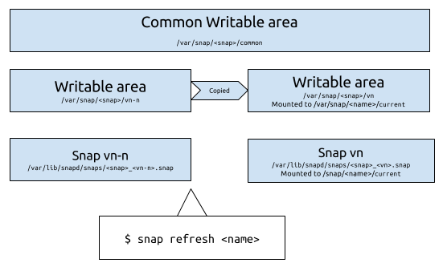

Title: Transactional Updates
# Transactional Updates
Snapd Systems employ a method of transactional update that is available for all snaps: application, gadget, OS and kernel.

## Installation
Each snap -- be it a kernel, OS, gadget or application snap -- is delivered as a read only, squashfs file. When installed it's stored in a directory named with its version number and accompanied by versioned writable spaces (and all are symlinked to `current`). In addition, the snap also gets a common multi-version writable space.

## Update (Refresh)
When the snap is updated (by the user running `$ snap refresh <snap name>`) a new set of directories are created labeled with the snap's revision number (which is icremented each time a snap is added to the store). The read-only image of the new version is stored in the new directory (`/var/lib/snapd/snaps/<snap>_<rev>.snap`), new writable spaces are created, and the data from the previous version's writable spaces copied to the new one. Data in the common space isn't altered in any way. The new version's snap and writable areas then are both symlinked to `current`. The process is illustrated below:

Updated kernel, OS, and gadget snaps becomes available the next time the system is booted. For updated application snap, new versions become available:

- for user executed applications, the next time the commend is run.
- for daemon executed services, immediately as the daemon in restarted during refresh. 

## Rollback

A strength of the snappy transactional update system is its ability to roll back if the new version of a snap proves faulty. The process is very simple, the `current` symlink for the snap and its writable data area are simply linked back to the old (previously working) version of the snap.

For application snaps the user does this with `snap rollback <snap>`. While for the Kernel and OS snaps, if these fail to start correctly, the snappy system will automatically rollback these snaps the next time the device is booted.